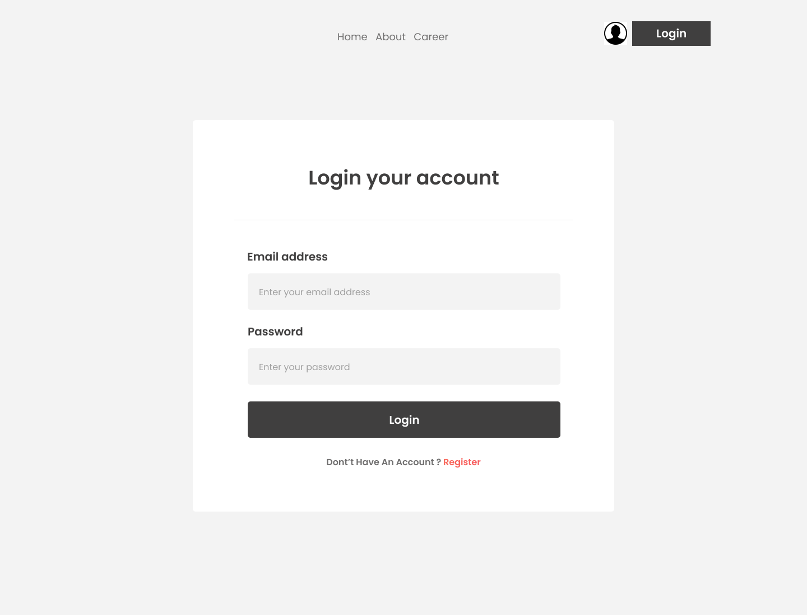
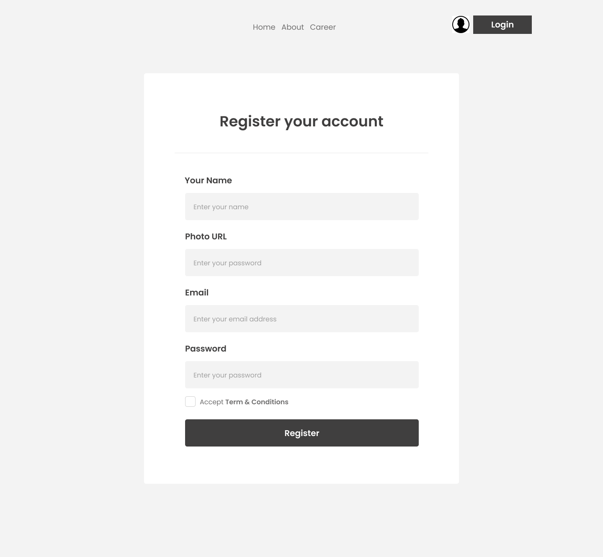
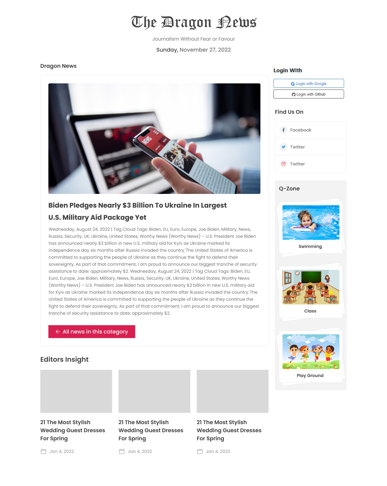

# 📰 Dragon News - React Firebase News Portal

Dragon News is a responsive news portal web application built using React. The project includes user authentication, protected routing, category-based news navigation, and a modern responsive user interface.

---

## 📸 Project Screenshots
## 📸 Project Screenshots

<h3>Home Page</h3>


<h3>Login Page</h3>


<h3>Register Page</h3>


<h3>News Details Page</h3>


## 🚀 Features

- React-based Single Page Application (SPA)
- React Router DOM Navigation
- Firebase Authentication
- Email & Password Registration/Login
- Google Authentication
- GitHub Authentication
- Protected Private Routes
- Category-Based News Navigation
- Dynamic News Details Page
- JSON-Based Data Loading
- Responsive Design
- Tailwind CSS Styling
- DaisyUI Components
- Component-Based Architecture
- Loading Spinner Implementation
- Reusable Layout Structure

---

## 🛠 Technologies Used

### Frontend

- React
- React Router DOM
- JavaScript (ES6+)
- Vite

### Authentication

- Firebase Authentication
- Email/Password Login
- Google Sign-In
- GitHub Sign-In

### Styling

- Tailwind CSS
- DaisyUI
- React Icons

### Data Handling

- JSON Data
- Fetch API

---

## 📄 Main Pages

### 🏠 Home Page

- Latest News Section
- News Categories
- Featured News Cards
- Right Sidebar
- Social Login Section
- Q-Zone Section

### 🔐 Login Page

- Email Login
- Password Login
- Google Sign-In
- GitHub Sign-In

### 📝 Register Page

- User Registration
- Password Validation
- Profile Information Collection

### 📰 News Details Page

- Detailed News Article View
- Category Navigation
- Related News Section

---

## 🔒 Authentication Features

This project uses Firebase Authentication.

Users can:

- Register with Email and Password
- Login with Email and Password
- Login using Google Account
- Login using GitHub Account
- Access Protected Routes
- Redirect to Previous Route After Login

---

## 📂 Project Structure

```text
src/
├── assets/
├── components/
│   ├── Header/
│   ├── Home/
│   ├── LatestNews/
│   ├── NavBar/
│   ├── Categories/
│   ├── FindUs/
│   ├── QZone/
│   └── SocialLogin/
│
├── layouts/
│   ├── HomeLayout.jsx
│   └── CategoryNews.jsx
│
├── pages/
│   ├── Login.jsx
│   ├── Register.jsx
│   └── NewsDetails.jsx
│
├── router/
│   └── router.jsx
│
├── App.jsx
├── main.jsx
└── index.css
```

---

## 🎯 Learning Objectives

This project was developed to practice:

- React Fundamentals
- React Router DOM
- Context API
- Firebase Authentication
- Private Routes
- State Management
- Component Reusability
- Responsive UI Design
- Tailwind CSS
- DaisyUI

---

## ⚡ Installation

```bash
git clone https://github.com/kaziashik/dragon-news-react-firebase.git

cd dragon-news-react-firebase

npm install

npm run dev
```

---

## 👨‍💻 Author

**Kazi Ashikur Rahman**

- GitHub: https://github.com/kaziashik
